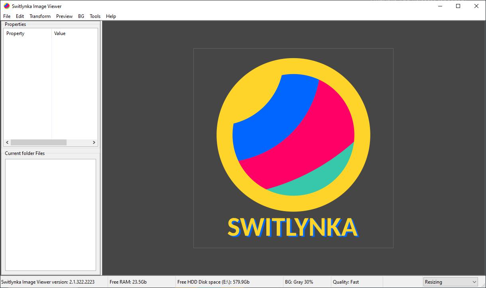

# 📷 Switlynka (Світлинка)

**Switlynka** — це багатофункціональний, швидкий та легкий переглядач графічних файлів із розширеними можливостями обробки зображень, пакетного конвертування, кадрування масками та створення відеоматеріалів за допомогою вбудованих рушіїв **ImageMagick** та **FFmpeg**.

Розроблено за допомогою **C++17** та фреймворку **wxWidgets**.

---

## 🚀 Основні можливості

- **Перегляд зображень:** підтримка поширених форматів (PNG, JPG, BMP, GIF, WEBP, TIFF, ICO, TGA, SVG, Base64).
- **Розширена підтримка форматів (ImageMagick):** відкриття рідкісних, векторних та RAW-форматів — детальний перелік дивіться у [ImageMagick - Supported Image Formats](https://imagemagick.org/formats).
- **Підтримка анімацій:** повноцінне розкладання та циклічне відтворення анімацій GIF, WebP, APNG із збереженням затримок кадру.
- **Багатопотокове сканування каталогів:** фоновий потік (`std::thread`) читає файли та генерує мініатюри без блокування або підвисання головного інтерфейсу.
- **Швидкий режим (Fast Speed Load):** миттєве завантаження списку папок через компактний список без побудови великих мініатюр.
- **Інтерактивне кадрування (Krita Style Crop Area):**
  - Виклик через меню або подвійний клік лівою кнопкою миші по полотну.
  - 8 маркерів (10×10 px) зі зміною вигляду курсора для точного масштабування.
  - Пропорційна зміна сторін при утриманні клавіші `Shift`.
  - 50% затемнення зони відсікання з підтвердженням за клавішею `Enter` або скасуванням через `Esc`.
- **Геометричні маски виділення:**
  - **Rectangle Mask (`F6`)** — прямокутне та квадратне кадрування.
  - **Circle Mask (`F7`)** — овальне та кругле кадрування із субпіксельним згладжуванням країв (anti-aliasing) і прозорим альфа-каналом.
- **Autorun App Manager:** перегляд та редагування автозавантаження системи (реєстр `HKCU`/`HKLM`, гілки `WOW6432Node`, каталоги `Startup`), можливість запуску, переходу до теки та UAC-підвищення привілеїв.
- **Робота з буфером обміну:** копіювання (`Ctrl+C`) та вставка (`Ctrl+V`) з підтримкою альфа-каналу й поточного екранного масштабування.
- **Розумне збереження налаштувань:** збереження стану відмічених пунктів меню, режиму розгортання вікна (`wxMAXIMIZE`) або його ширини/висоти у файл `property.json`.
- **Режим «Поверх інших вікон» (On Top Window):** динамічне закріплення програми над іншими вікнами операційної системи.
- **Пакетні інструменти:** інтеграція з ImageMagick (рескейл теки, створення спрайтів і GIF) та FFmpeg (відео з картинок, нарізка кадрів з відео).

---

## 🖥️ Структура меню програми

### 📁 Меню «File»
- **New Background... (`Ctrl+N`)** — створення однотонного зображення заданого розміру/шаблону (Full HD, 4K, A4 тощо) із можливістю накладання рамки.
- **Open File... (`Ctrl+O`)** — відкриття файлу через стандартний діалог вибору.
- **Save File As... (`Ctrl+S`)** — збереження поточного зображення у вибраному форматі з максимальною якістю.
- **Save File As Resizing... (`Ctrl+Shift+S`)** — експорт зображення у поточному екранному розмірі.
- **Save Property (`Ctrl+Shift+P`)** — збереження налаштувань перемикачів меню та геометрії вікна в `property.json`.
- **Quit (`Ctrl+Q`)** — вихід із програми.

### ✂️ Меню «Edit»
- **Undo (`Ctrl+Z`)** — скасування останніх змін (до 15 кроків історії).
- **Copy (`Ctrl+C`)** — копіювання зображення в буфер обміну.
- **Paste (`Ctrl+V`)** — створення нового полотна з графічних даних буфера обміну.
- **Brightness / Contrast (`Ctrl+B`)** — діалог коригування яскравості й контрасту з живим переглядом.
- **Grayscale (`Ctrl+G`)** — переведення зображення у відтінки сірого зі збереженням альфа-каналу.
- **Blur (`Ctrl+R`)** — повне, горизонтальне або вертикальне розмиття.
- **Crop... (`Alt+C`)** — геометричне кадрування за пропорціями (16:9, 9:16, 1:1) та формами.
- **Draw Rectangle Mask (`F6`)** — малювання прямокутної маски кадрування олівцем.
- **Draw Circle Mask (`F7`)** — малювання овальної/круглої маски кадрування
- **Crop Image Area (`Alt+A` / Подвійний клік)** — інтерактивна рамка кадрування в стилі Krita з 8 маркерами зміни розміру.

### 🔄 Меню «Transform»
- **Rotate 90 (`Alt+.`)** — поворот за годинниковою стрілкою на 90°.
- **Rotate -90 (`Alt+,`)** — поворот проти годинникової стрілки на 90°.
- **Rotate 180** — розворот зображення на 180°.
- **Flip Horizontal (`Alt+[`)** — горизонтальне віддзеркалення.
- **Flip Vertical (`Alt+]`)** — вертикальне віддзеркалення.

### 🎨 Меню «Preview» та «BG»
- **Quality (Default, None, Fast, Good, Best)** — вибір алгоритмів інтерполяції та антиаліасингу під час масштабування.
- **Show Property List (`Alt+9`)** — перемикання видимості панелі властивостей зображення.
- **Show Folder List (`Alt+0`)** — перемикання видимості панелі файлів поточної теки.
- **Show Full Screen (`F11`)** — перехід у повноекранний режим та вихід із нього.
- **BG Color (`Ctrl+0` ... `Ctrl+7`)** — вибір підкладки робочого полотна (за замовчуванням, чорний, білий, градації сірого, кольорові шаблони).

### 🛠️ Меню «Tools»
- **Open File (ImageMagick) (`Alt+Shift+O`)** — відкриття складних або рідкісних форматів файлів через рушій ImageMagick.
- **Folder Rescale (ImageMagick) (`Alt+Shift+P`)** — пакетне перемасштабування, створення GIF-анімацій чи монтажних Sprite Sheet.
- **Images Folder As Video (FFMpeg) (`Alt+I`)** — конвертація теки зображень у відеоряд (MP4, MOV, MKV, GIF) із переходами.
- **Video As Images (FFMpeg) (`Alt+Shift+I`)** — розбивка відеофайлу на послідовність окремих кадрів.

### ❓ Меню «Help»
- **Register Image Formats** — реєстрація програми у системних асоціаціях Windows/Linux як переглядача за замовчуванням.
- **Open Property File** — відкриття конфігураційного файлу `property.json` у програмі за замовчуванням.
- **System Information (`Alt+Shift+S`)** — відображення звіту про параметри апаратного забезпечення (ОС, CPU, RAM, диски, GPU VRAM).
- **System PATH Editor (`F5`)** — вбудований графічний редактор змінних середовища `PATH`.
- **Autorun App Manager (`Alt+Shift+A`)** — керування програмами з автозапуску системи.
- **Change Monitor Brightness (`Alt+Shift+L`)** — апаратне налаштування яскравості монітора через інтерфейс DDC/CI.
- **Send Report (`F8`)** — відправка діагностичного звіту або відгуку.
- **Fast Speed load images (`F9`)** — режим прискореного перегляду папок без генерації важких мініатюр.
- **On Top Window (`Alt+F9`)** — закріплення вікна програми поверх інших вікон.
- **Shortcut Help (`F3`)** — інтерактивний список усіх підтримуваних гарячих клавіш.
- **About (`F1`)** — відображення відомостей про версію та автора.

---

## ⚙️ Основні методи та внутрішня архітектура

- **`StartCropAreaMode()` / `RenderCropOverlay()` / `ApplyCropArea()`** — логіка інструмента кадрування: розрахунок 8 активних маркерів, малювання напівпрозорого шару 50% затемнення, збереження пропорцій із `Shift` та обрізання реального кадру.
- **`ScanFolder()` / `StartBackgroundScan()` / `OnThumbnailItemReady()`** — асинхронне сканування каталогів: робота з файлами виконується у фоновому потоці `std::thread`, а елементи додаються в `wxListCtrl` через безпечну чергу `wxQueueEvent` без зависання інтерфейсу.
- **`UpdateScaledBitmap()` / `OnPaintImage()`** — рендеринг графічного полотна на базі подвійно буферизованої панелі `m_panelBitmap` (`wxAutoBufferedPaintDC`) із чистим змішуванням альфа-каналу замість застарілого `wxStaticBitmap`.
- **`SaveMenuPropertiesToJson()` / `LoadMenuPropertiesFromJson()`** — серіалізація та десеріалізація стану чекбоксів/радіо-кнопок, а також геометрії вікна (звичайний розмір або стан `maximized`) у файл `property.json`.
- **`SetStayOnTop()`** — виклик системного перемикання `HWND_TOPMOST` для утримання вікна поверх інших програм.
- **`CheckAndLoadAnimation()` / `ExtractAnimationWithMagickOrFFmpeg()`** — декодування GIF/WebP/APNG у кеш кадрів за допомогою ImageMagick чи апаратного декодера FFmpeg із точним таймінгом.

---

## 📦 Завантаження та встановлення

Програма поширюється у вигляді автономних портативних (Portable) архівів, які не потребують встановлення:

1. Перейдіть у розділ **[Releases](../../releases)** на GitHub.
2. Завантажте останній архів `Switlynka_vX.X.X.zip`.
3. Розпакуйте архів у зручну папку на диску.
4. Запустіть файл `Switlynka.exe`.

---

## 👤 Автор
**AOSNEC (Петро Бган / Petro Bhan)**
- Веб-сайт: [aosnec.com](https://aosnec.com)
- GitHub: [github.com/aosnec/Switlynka](https://github.com/aosnec/Switlynka)
