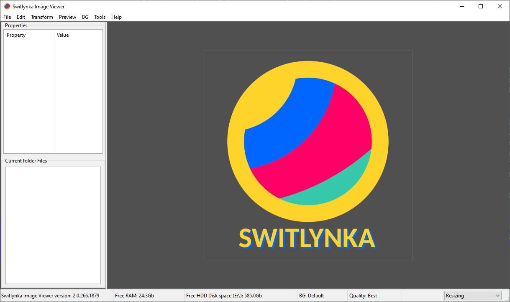

# 📷 Switlynka (Світлинка)

**Switlynka** — це багатофункціональний, швидкий та легкий переглядач графічних файлів із розширеними можливостями обробки зображень, пакетного конвертування, кадрування масками та створення відеоматеріалів за допомогою вбудованих рушіїв **ImageMagick** та **FFmpeg**.

Розроблено за допомогою **C++17** та фреймворку **wxWidgets**.

---

## 🚀 Основні можливості

- **Перегляд зображень:** підтримка поширених форматів (PNG, JPG, BMP, GIF, WEBP, TIFF, ICO, TGA, SVG, Base64).
- **Розширена підтримка форматів (ImageMagick):** відкриття сотень рідкісних, векторних та професійних форматів — детальний перелік дивіться у [ImageMagick - Supported Image Formats](https://imagemagick.org/formats).
- **Підтримка анімацій:** повноцінне відтворення GIF, WebP та APNG з апаратним GPU-прискоренням.
- **Швидкий режим (Fast Speed Load):** перемикання списку каталогу у режим надшвидкого завантаження без генерації важких мініатюр для комфортної роботи з архівами на тисячі файлів.
- **Маски виділення та Crop:**
  - **Rectangle Mask** — прямокутне та квадратне (із затиснутою клавішею `Shift`) кадрування з інтерактивною напівпрозорою підсвіткою.
  - **Circle Mask** — овальне та кругле кадрування з субпіксельним згладжуванням країв (anti-aliasing) та прозорим альфа-каналом.
- **Буфер обміну:** інтеграція з буфером обміну ОС (`Ctrl+C` / `Ctrl+V`) з підтримкою 32-бітного альфа-каналу та змінених розмірів.
- **Конвертація відео та зображень (FFmpeg):**
  - Пакетне перетворення відеофайлів у секвенції зображень.
  - Створення слайдшоу та відеороликів із папки зображень із налаштуванням переходів (Gallery Fade), роздільної здатності та частоти кадрів (FPS).
- **Пакетне масштабування (ImageMagick):** зміна розміру всіх зображень у каталозі з вибором алгоритмів збереження пропорцій та кадрування.
- **Керування апаратною яскравістю монітора:** пряме регулювання яскравості дисплея за стандартом DDC/CI.
- **Системний редактор PATH:** зручний графічний менеджер змінних середовища Windows.

---

## 🖥️ Структура меню програми

### 📁 Меню «File»
- **New Background... (`Ctrl+N`)** — створення нового однотонного полотна заданого кольору, розміру чи шаблону (Full HD, 4K тощо) з можливістю додавання рамки.
- **Open File... (`Ctrl+O`)** — відкриття зображення з диска.
- **Save File As... (`Ctrl+S`)** — збереження поточного зображення у вибраному форматі.
- **Save File As Resizing... (`Ctrl+Shift+S`)** — збереження зі зміною роздільної здатності.
- **Quit (`Ctrl+Q`)** — завершення роботи програми.

### ✂️ Меню «Edit»
- **Undo (`Ctrl+Z`)** — скасування останньої виконаної дії (трансформацій, фільтрів, кадрування).
- **Copy (`Ctrl+C`)** — копіювання поточного зображення (або його масштабованої версії) у системний буфер обміну зі збереженням альфа-каналу.
- **Paste (`Ctrl+V`)** — створення нового зображення з буфера обміну.
- **Brightness / Contrast (`Ctrl+B`)** — інтерактивне коригування яскравості та контрастності зображення.
- **Grayscale (`Ctrl+G`)** — перетворення зображення у градації сірого.
- **Blur (`Ctrl+R`)** — застосування радіального або спрямованого розмиття.
- **Crop... (`Alt+C`)** — діалог пропорційного кадрування.
- **Draw Rectangle Mask (`F6`)** — режим малювання прямокутної/квадратної маски кадрування.
- **Draw Circle Mask (`F7`)** — режим малювання овальної/круглої маски кадрування.

### 🔄 Меню «Transform»
- **Rotate 90 (`Alt+.`)** — поворот на 90° за годинниковою стрілкою.
- **Rotate -90 (`Alt+,`)** — поворот на 90° проти годинникової стрілки.
- **Rotate 180** — розворот на 180°.
- **Flip Horizontal (`Alt+[`)** — віддзеркалення по горизонталі.
- **Flip Vertical (`Alt+]`)** — віддзеркалення по вертикалі.

### 🎨 Меню «Preview» та «BG»
- **Quality (Default, None, Fast, Good, Best)** — вибір алгоритмів фільтрації та антиаліасингу під час масштабування перегляду.
- **BG Color (`Ctrl+0` ... `Ctrl+7`)** — миттєва зміна фонового кольору робочої області (чорний, білий, сірі тони, кольорові шаблони) для оцінки прозорості.

### 🛠️ Меню «Tools»
- **Open File (ImageMagick) (`Alt+Shift+O`)** — відкриття рідкісних та специфічних графічних форматів через рушій ImageMagick. Ознайомитися з повним списком можна за посиланням: [ImageMagick - Supported Image Formats](https://imagemagick.org/formats).
- **Folder Rescale (ImageMagick) (`Alt+Shift+P`)** — пакетне масштабування та конвертація всіх зображень у каталозі.
- **Images Folder As Video (FFMpeg) (`Alt+I`)** — рендеринг відеогалерей та слайдшоу з переходів між фотографіями.
- **Video As Images (FFMpeg) (`Alt+Shift+I`)** — розбивка відео на кадри або витяг стоп-кадрів.

### ❓ Меню «Help»
- **Register Image Formats** — асоціація розширень файлів із програмою у системі.
- **System Information (`Alt+Shift+S`)** — виведення характеристик системи (ЦП, ОЗП, відеокарта).
- **System PATH Editor (`F5`)** — вбудований редактор змінних середовища.
- **Change Monitor Brightness (`Alt+Shift+L`)** — апаратне налаштування яскравості дисплея.
- **Send Report (`F8`)** — форма зворотного зв'язку для відправки відгуків, повідомлень про помилки та побажань.
- **Fast Speed load images (`F9`)** — перемикання між детальним каталогом мініатюр (150x150 px) та швидким списком (16x16 px).
- **Shortcut Keys Dialog** — повний інтерактивний список усіх доступних гарячих клавіш програми.
- **About (`F1`)** — інформація про програму та автора.

---

## 📦 Завантаження та встановлення

Програма поширюється у вигляді готових портативних (Portable) архівів, які не потребують встановлення:

1. Перейдіть у розділ **[Releases](../../releases)** праворуч.
2. Завантажте останній архів `Switlynka_vX.X.X.zip`.
3. Розпакуйте архів у зручну папку на диску.
4. Запустіть файл `Switlynka.exe`.

---

## 👤 Автор
**AOSNEC (Петро Бган / Petro Bhan)**  
- Веб-сайт: [aosnec.com](https://aosnec.com)
